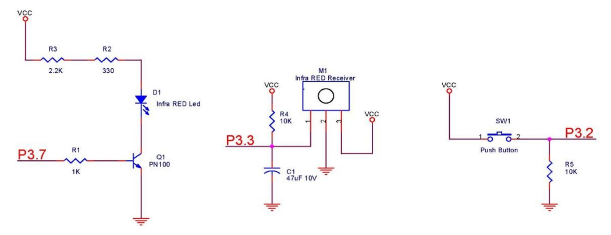
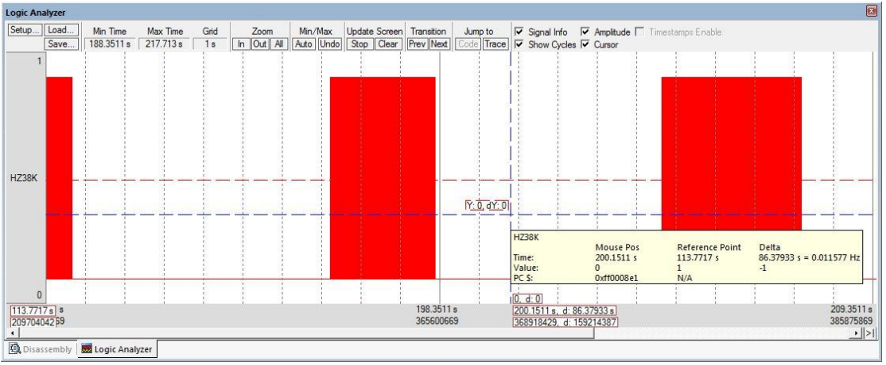
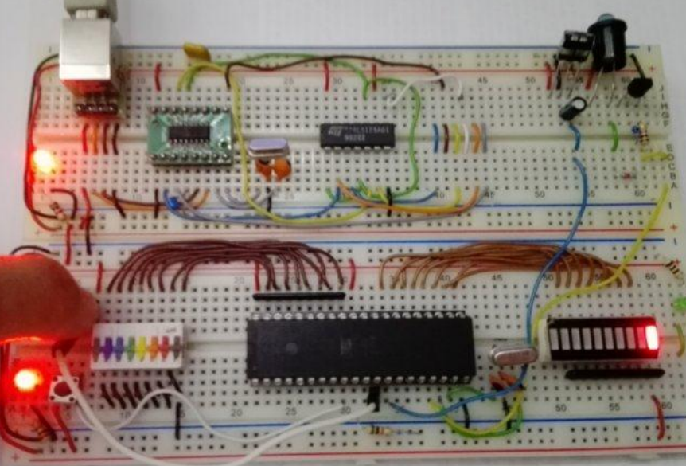

# Obstacle Avoidance System
- This system is about programming a 8052 microcontroller for Obstacle Avoidance System.

**Components**

- 8052 MC.
- Infrared transmitter and receiver.
- Crystals
- CH340 USB to Serial chip.

**How it works**

- By using timers and interrupts.
- A modulated signal of 38Khz is generated and is transmitted by the infrared transmitter when the button is pressed.
- If there is an obstacle, the light wave is reflected and is captured by the infrared receiver which LED lights up.

**Schematic**

**Modulated Signal**

**Connection**

